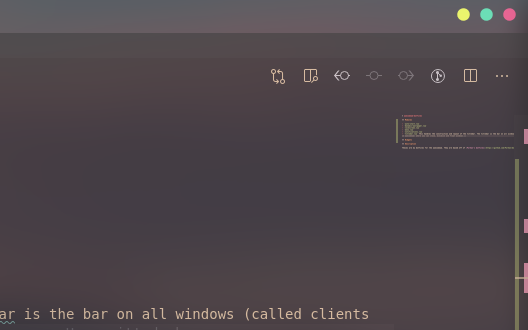

# awesomewm-dotfiles

## Description

Theses are my dotfiles for the awesomewm. They are based off of [Purhan's dotfiles](https://github.com/Purhan/dotfiles).

## Modules

- `auto-start.lua` TODO
- `dynamic-wallpaper.lua` TODO
- `lockscreen.lua` TODO
- `menu.lua` TODO
- `notifications.lua` TODO
- `titlebar.lua` This handles the construction and layout of the titlebar. The titlebar is the bar on all windows (called clients in awesomewm) where you can close, minimize and float windows. 

## Widgets

TODO
